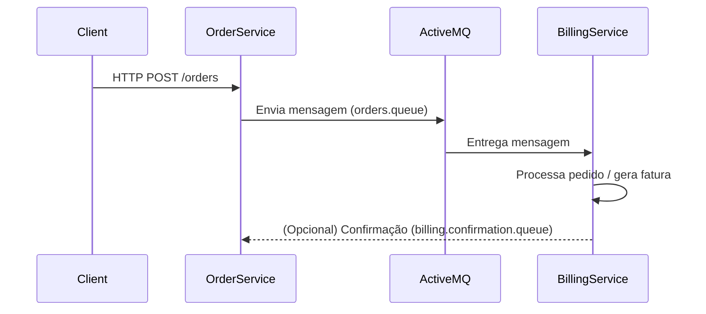

# Checkpoint 6 — Comunicação Assíncrona com Spring Messaging e ActiveMQ

Este projeto implementa o cenário do **Checkpoint 6**, utilizando dois microsserviços independentes que se comunicam de forma assíncrona via **ActiveMQ**:

- **order-service**: expõe um endpoint REST para criação de pedidos e envia mensagens para uma fila no ActiveMQ.
- **billing-service**: consome as mensagens da fila, processa o pedido e simula a geração da fatura.

A comunicação é totalmente desacoplada, baseada em mensagens, sem chamadas HTTP diretas entre os serviços.

## Estrutura do repositório

```text
/
├─ order-service/
│  ├─ pom.xml
│  └─ src/...
├─ billing-service/
│  ├─ pom.xml
│  └─ src/...
├─ docker-compose.yml
└─ README.md
```

Cada pasta (`order-service` e `billing-service`) é um projeto Spring Boot independente.

## Tecnologias utilizadas

- Java 17
- Spring Boot
- Spring Web
- Spring JMS / Spring Messaging
- ActiveMQ (Classic)
- Docker & Docker Compose
- Maven

## Pré-requisitos

- **Java 17** instalado
- **Maven** instalado
- **Docker** e **Docker Compose** instalados e em execução

---

## 1. Subindo o ActiveMQ (Docker Compose)

Na raiz do projeto, há um arquivo `docker-compose.yml` configurando o ActiveMQ com credenciais simples:

- Usuário: `admin`
- Senha: `admin`
- Broker URL: `tcp://localhost:61616`

Para subir o ActiveMQ:

```bash
docker-compose up -d
```

Verifique se o container está rodando:

```bash
docker ps
```

A interface web do ActiveMQ (quando configurada no compose) costuma estar em:

- `http://localhost:8161` (se exposta)

---

## 2. Executando os serviços

### 2.1. Order Service

Responsável por receber pedidos via HTTP e enviar mensagens JSON para a fila `orders.queue`.

Passos:

```bash
cd order-service
mvn clean package
mvn spring-boot:run
```

Configuração principal (exemplo em `application.properties`):

- Porta HTTP: `8081`
- ActiveMQ: `tcp://localhost:61616`
- Fila de saída: `orders.queue`

### 2.2. Billing Service

Responsável por consumir mensagens da fila `orders.queue`, logar o pedido recebido e simular a geração da fatura.

Passos:

```bash
cd billing-service
mvn clean package
mvn spring-boot:run
```

Configuração principal (exemplo em `application.properties`):

- Porta HTTP: `8082`
- ActiveMQ: `tcp://localhost:61616`
- Fila escutada: `orders.queue`
- (Opcional) Fila de confirmação: `billing.confirmation.queue`

O listener utiliza `@JmsListener` para processar mensagens de forma automática.

---

## 3. Como testar o fluxo

Com **ActiveMQ**, **order-service** e **billing-service** em execução:

### 3.1. Enviar um pedido

Faça um `POST` para o `order-service`:

```bash
curl -X POST http://localhost:8081/orders   -H "Content-Type: application/json"   -d '{"id":"1","customerName":"Gabriel","amount":300.00}'
```

Ou equivalente via Postman/Insomnia.

O `order-service` deve responder algo como:

```text
Order sent to queue: 1
```

### 3.2. Verificar o consumo no Billing Service

No console do **billing-service** você deverá ver logs semelhantes a:

```text
[BillingService] Recebido pedido: 1 | Cliente: Gabriel | Valor: 300.0
[BillingService] Fatura gerada para pedido 1
```

Isso comprova:

- Envio assíncrono pelo `order-service` para a fila `orders.queue`.
- Consumo assíncrono pelo `billing-service` via JMS Listener.

### 3.3. (Opcional) Fila de confirmação

Caso implementado:

1. O `billing-service` envia uma mensagem de confirmação para `billing.confirmation.queue`.
2. O `order-service` possui um `@JmsListener` ouvindo essa fila e imprime no console a confirmação da fatura.

Inclua prints dessa troca se o desafio opcional for utilizado.

---

## 4. Evidências para a correção

Para apoiar a avaliação, inclua no repositório (ou anexe na plataforma):

- Prints ou logs do **order-service** mostrando o envio do pedido.
- Prints ou logs do **billing-service** mostrando:
  - pedido recebido com `id`, `customerName`, `amount`;
  - mensagem de fatura gerada.
- (Opcional) Prints da confirmação de faturamento retornando para o `order-service`.
- Um pequeno diagrama do fluxo de mensagens (Mermaid, PlantUML ou imagem), por exemplo:



---

## 5. Como executar rapidamente (resumo)

1. `docker-compose up -d` (subir ActiveMQ)
2. Em um terminal:
   ```bash
   cd order-service
   mvn spring-boot:run
   ```
3. Em outro terminal:
   ```bash
   cd billing-service
   mvn spring-boot:run
   ```
4. Enviar `POST` para `http://localhost:8081/orders` com um JSON de pedido.
5. Conferir os logs do `billing-service`.

---

## 6. Observações finais

- Os serviços são independentes e se comunicam **somente via ActiveMQ**.
- O uso de `@JmsListener`, `JmsTemplate` e `MappingJackson2MessageConverter` garante o envio/recebimento de mensagens JSON.
- As credenciais, filas e portas podem ser ajustadas conforme necessidade, desde que mantido o comportamento descrito no enunciado.
